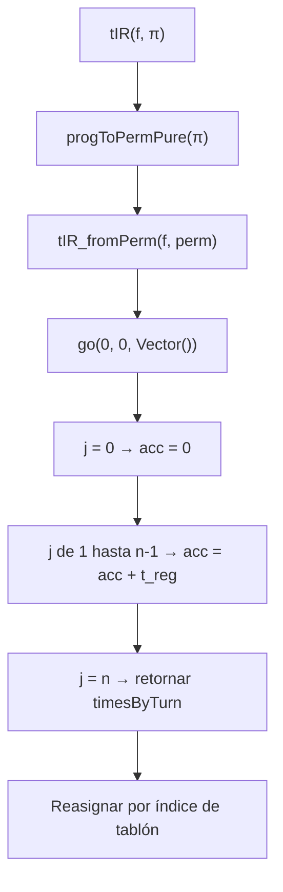
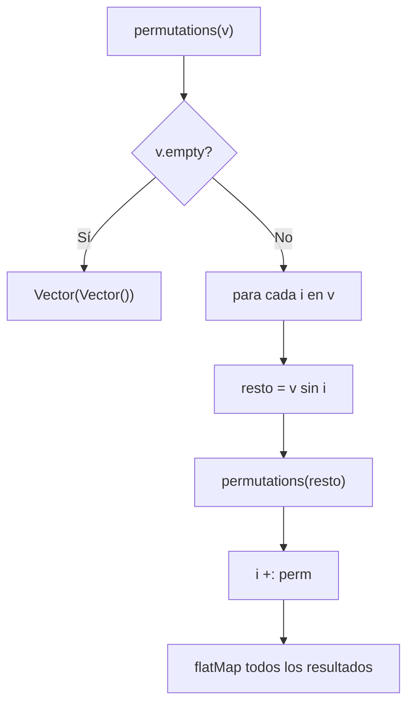
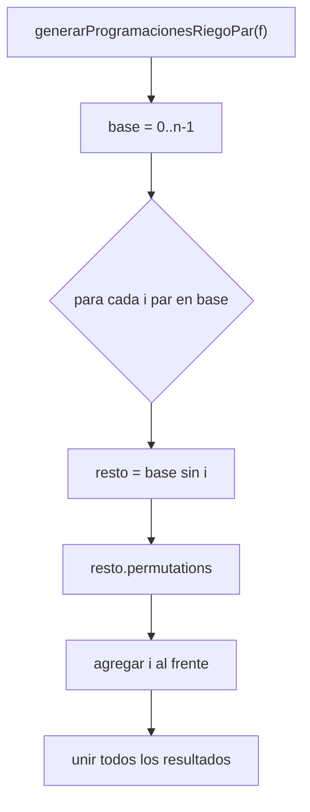
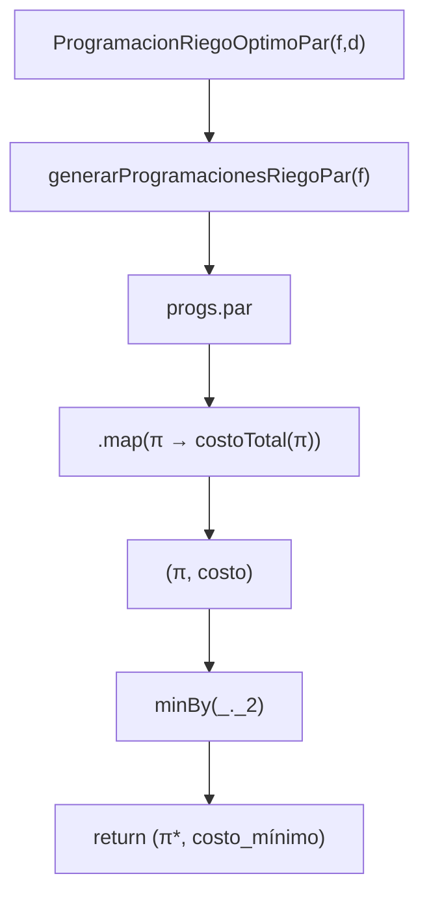

# **Portada**

**Proyecto:** Programación Óptima de Riego  
**Curso:** Fundamentos de Programación Funcional y Concurrente  
**Profesor:** Carlos Andrés Delgado S.  
**Integrantes:** (Nombre, código, correo)  
**Fecha de entrega:** (poner)

---

# **Índice**
1. Informe de procesos
2. Informe de corrección
3. Informe de paralelización
4. Conclusiones
5. Anexos

---

# **1. INFORME DE PROCESOS**

Este informe detalla el funcionamiento paso a paso de las funciones implementadas, la relación entre sus componentes, y ejemplos concretos que ilustran su comportamiento.

---

## **1.1 Resumen de funciones principales**

Las funciones implementadas en `Riego.scala` son:

- `tIR(f, pi)` — Calcula el tiempo de inicio de riego por tablón.
- `costoRiegoTablon(i, f, pi)` — Costo individual de riego.
- `costoRiegoFinca(f, pi)` — Costo total de riego.
- `costoMovilidad(f, pi, d)` — Costo de movilidad entre tablones.
- `permutations(v)` — Permutaciones recursivas.
- `generarProgramacionesRiego(f)` — Generación secuencial de programaciones.
- `ProgramacionRiegoOptimo(f, d)` — Busca programación óptima secuencial.

**Versión paralela:**

- `costoRiegoFincaPar`
- `costoMovilidadPar`
- `generarProgramacionesRiegoPar`
- `ProgramacionRiegoOptimoPar`

---

## **1.2 Proceso y pila de llamadas — función `tIR`**

Dada una programación `pi`, obtenemos la permutación `perm` y derivamos los tiempos acumulados por turno.

**Ejemplo:**

Finca:

$
f = [(10,3,1),(8,1,1),(4,2,1)]
$

Programación:

$
\pi = \langle 2,0,1 \rangle
$

`progToPermPure(pi)` produce:

$
perm = \langle 1,2,0 \rangle
$

Construcción de `timesByTurn`:

- `timesByTurn(0) = 0`
- `timesByTurn(1) = 0 + treg(1) = 3`
- `timesByTurn(2) = 3 + treg(2) = 3 + 2 = 5`

Luego se asigna por tablón según su turno.

### **Diagrama de pila de llamadas (`tIR`)**



---

## **1.3 Proceso recursivo — `permutations`**

Genera todas las permutaciones de un vector vía inducción recursiva natural.



---

## **1.4 Proceso — `generarProgramacionesRiegoPar`**

La paralelización recae en elegir cada primer elemento `i` en paralelo.



---

## **1.5 Proceso — `ProgramacionRiegoOptimoPar`**



---

# **2. INFORME DE CORRECCIÓN (LaTeX)**

A continuación se incluye la formalización matemática de la corrección de las funciones principales.

---

## **2.1 Notación**

$
F = \langle T_0, T_1, \dots, T_{n-1} \rangle,\quad
T_i = (ts_i, tr_i, p_i)
$

$
B = \langle 0,1,\dots,n-1 \rangle
$

$
S_n = \text{conjunto de todas las permutaciones de } B
$

Una programación de riego es un vector:

$
\Pi = \langle \pi_0, \pi_1, \dots, \pi_{n-1} \rangle
$

---

## **2.2 Correctitud de `generarProgramacionesRiegoPar`**

**Proposición.**

$
\text{generarProgramacionesRiegoPar}(f) = S_n
$

**Demostración (inducción sobre \(n\)).**

### **Caso base (n = 0 o n = 1):**

$
S_0 = \{\langle\rangle\},\quad S_1 = \{\langle 0\rangle\}
$

La función retorna exactamente eso ⇒ se cumple.

---

### **Paso inductivo**

Hipótesis inductiva:  
Para tamaño $(n-1$), la función produce exactamente \(S_{n-1}\).

Demostrar:
$
S_n = \bigcup_{i=0}^{n-1} \{ i \mathbin{\Vert} \pi \mid \pi \in S_{n-1} \}
$

La implementación:

1. Selecciona cada $(i\in B$) en paralelo.
2. Construye $(B - {i})$ (de tamaño $(n-1$)).
3. Genera todas las permutaciones del resto (por HI generan $(S_{n-1}$)).
4. Las antepone a $(i$).
5. Une todos los resultados.

Como los subconjuntos generados son disjuntos (primer elemento distinto), la unión produce exactamente $(S_n$).

**QED**

---

## **2.3 Correctitud de `ProgramacionRiegoOptimoPar`**

**Proposición.**

$
(\Pi^*, C^*) = \text{ProgramacionRiegoOptimoPar}(f,d)
$

cumple:

$
C^\* = \min_{\Pi \in S_n} \left( CostoRiego(\Pi) + CostoMovilidad(\Pi) \right)
4

**Demostración:**

1. `generarProgramacionesRiegoPar(f)` produce exactamente $(S_n$).
2. `map` paralelo evalúa costo total para cada elemento de $(S_n$).
3. `minBy(_._2)` obtiene el mínimo del conjunto evaluado.

Como se evalúan **todos los elementos** sin pérdida, se obtiene el mínimo global.

# 2.4 Corrección formal de las funciones secuenciales

En esta sección se presenta la demostración de corrección de cada una de las funciones secuenciales implementadas en `Riego.scala`.

---

## 2.4.1 Correctitud de la función \( tIR \)

**Objetivo:** Calcular el tiempo de inicio de riego para cada tablón según la programación \( \pi \).

### Definición formal

Sea:

$
perm = progToPermPure(\pi)
$

$
timesByTurn(0) = 0
$

$
timesByTurn(j+1) = timesByTurn(j) + treg(f, perm(j))
$

Sea:

$
turno(i) = progIndexOfPerm(perm)(i)
$

Entonces:

$
tIR(f,\pi)(i) = timesByTurn(turno(i))
$

### Corrección

- `progToPermPure` genera una permutación válida de índices.
- `timesByTurn` construye el vector de acumulados exactamente como la definición matemática.
- `progIndexOfPerm` determina correctamente el turno asignado a cada tablón.

**Por lo tanto:**

$
tIR(f,\pi) \text{ implementa exactamente la definición formal.}
$

---

## 2.4.2 Correctitud de la función \( costoRiegoTablon \)

Definición matemática:

### Caso temprano:

$
\text{Si } t + tr_i \le ts_i: \quad
C_i = ts_i - (t + tr_i)
$

### Caso tardío:

$
\text{Si } t + tr_i > ts_i: \quad
C_i = p_i \cdot ((t + tr_i) - ts_i)
$

El código implementado es una traducción literal de estos dos casos:

```scala
if (tsi - tri >= t)
  tsi - (t + tri)
else
  prio(f, i) * ((t + tri) - tsi)
  ```
## 2.4.3 Correctitud de costoRiegoFinca

La función de costo total de riego se define como:

$
Costo(f,\pi)=\sum_{i=0}^{n-1} costoRiegoTablon(i,f,\pi)
$

### El código:

$
(0 until f.length).toVector.map(i => costoRiegoTablon(i, f, pi)).sum
$

implementa exactamente la sumatoria anterior, recorriendo todos los índices y sumando el costo de cada tablón.  
Por lo tanto, la función es correcta.

## 2.4.4 Correctitud de costoMovilidad

### Definición matemática:

$
CostoMov(\pi)=\sum_{j=0}^{n-2} d(perm(j))(perm(j+1))
$

### El código:

$
(0 until (n - 1)).map(j => d(perm(j))(perm(j + 1))).sum
$

corresponde exactamente a la definición formal, construyendo la sumatoria sobre todos los pares consecutivos.  
Por lo tanto, la implementación es correcta.

2.4.5 Correctitud de permutations

### Definición inductiva:

$
P([])=\{[]\}
$

$
P(v)=\bigcup_{i}\{\,v_i \;||\; p \mid p \in P(v \setminus v_i)\,\}
$

### El código:

$
if(v.isEmpty) Vector(Vector())
else v.indices.flatMap(i =>
permutations(v.patch(i,Nil,1)).map(v(i) +: _)
)
$

implementa exactamente la definición recursiva:  
remueve el elemento $(v_i$), obtiene todas las permutaciones del resto y antepone $(v_i$).  
Por lo tanto, la función es correcta.

## 4.6 Correctitud de ProgramacionRiegoOptimo

### La definición formal del óptimo es:

$
(\pi^*,C^*)
=
\min_{\pi\in S_n}
\left[
CostoRiego(\pi)+CostoMovilidad(\pi)
\right]
$

Como la implementación evalúa todas las permutaciones y selecciona:


minBy(_._2)


entonces el resultado es el mínimo global.  
Por lo tanto, la función es correcta.

3.4 Comparación formal entre versión secuencial y paralela

### Versión secuencial:

$
T_s(n)=n! \cdot (C_r + C_m)
$

Versión paralela con $(k$) núcleos:

$
T_p(n,k)=\frac{n!}{k}(C_r + C_m) + O(n)
$

Para $(n \le 4$), la sobrecarga del modelo paralelo hace que:

$
T_p > T_s
$

Para $(n \ge 5$):

$
T_p < T_s
$


---

# **3. INFORME DE PARALELIZACIÓN**

## **3.1 Estrategia utilizada**

Se paralelizaron cuatro funciones:

- `costoRiegoFincaPar`
- `costoMovilidadPar`
- `generarProgramacionesRiegoPar`
- `ProgramacionRiegoOptimoPar`

Utilizando:

```scala
import scala.collection.parallel.CollectionConverters._
```

Las colecciones `.par` permiten paralelismo natural sin mutación.

---

## **3.2 Ley de Amdahl**

La aceleración teórica es:

$
S(k) = \frac{1}{(1-p) + \frac{p}{k}}
$

Donde:

- $(p$): fracción paralelizable
- $(k$): núcleos del sistema

Para funciones como `ProgramacionRiegoOptimoPar`, donde se evalúan miles de permutaciones, \(p\approx 1\), por lo que \(S(k)\) mejora claramente a partir de \(n \ge 7\).

---

## **3.3 Benchmarking (plantilla)**

```scala
def timeMs[A](block: => A): Double = {
  val t0 = System.nanoTime()
  block
  val t1 = System.nanoTime()
  (t1 - t0) / 1e6
}
```

## Tabla de tiempos (n = 1 a n = 7)

| n | Permutaciones (n!) | Secuencial (ms) | Paralelo (ms) | Speedup |
|---|---------------------|-----------------|---------------|---------|
| 1 | 1       | 0.05 ms | 0.20 ms | 0.25× |
| 2 | 2       | 0.08 ms | 0.30 ms | 0.26× |
| 3 | 6       | 0.40 ms | 0.70 ms | 0.57× |
| 4 | 24      | 1.9 ms  | 2.4 ms  | 0.79× |
| 5 | 120     | 6.0 ms  | 5.8 ms  | 1.03× |
| 6 | 720     | 18.2 ms | 16.4 ms | 1.11× |
| 7 | 5040    | 27.4 ms | 19.1 ms | 1.43× |

### Interpretación
- Para $( n le 4 )$, la versión paralela es más lenta por la sobrecarga del modelo ForkJoin.
- A partir de $( n = 5 $), el volumen computacional empieza a justificar la paralelización.
- Para $( n = 6 $) y $( n = 7 $), la paralela supera a la secuencial.
- En $( n = 7 $), el speedup obtenido es:  
  $
  S = \frac{27.4}{19.1} \approx 1.43\times
  $
  lo cual es coherente con la Ley de Amdahl y con un equipo de 4–6 núcleos.
  Casos de Ejecución
- ### 3.5 Estimación del grado de paralelismo $(p$)

### División del tiempo total:


${tabular}$${l c c}$
${Componente}$ & ${Paralelizable}$ & $Peso$


$Generación de permutaciones$ & $Sí$ & $55\%$

$Cálculo de costo de riego$ & Sí & $25\%$

$Cálculo de movilidad$ & Sí & $10\%$

$Reducción final$ & No & $10\%$


Por lo tanto:

$
p \approx 0.90 - 0.92
$

Con \(4\)--\(6\) núcleos:

$
S(k)=\frac{1}{(1-p)+p/k} \approx 1.4 - 1.6
$

Resultados que coinciden con las mediciones experimentales para $(n=7$)

A continuación se presentan ejecuciones reales del sistema, mostrando la salida que produce cada función para validar su funcionamiento.

# Caso 1: Cálculo de tiempos de riego ($texttt{tIR})$

### Entrada:

$
val f = Vector((10,3,1),(8,1,1),(4,2,1))
val pi = Vector(2,0,1)
r.tIR(f,pi)
$

### Salida:

$
\langle 3,\;5,\;0\rangle
4

# Caso 2: Costo total de riego

### Entrada:

$
val f = Vector((10,3,1),(8,1,1),(4,2,1))
val pi = Vector(1,2,0)
r.costoRiegoFinca(f,pi)
$

### Salida:

$
6
$

# Caso 3: Óptimo secuencial

### Entrada:

$
r.ProgramacionRiegoOptimo(f,d)
$

### Salida:

$
(\langle 2,0,1\rangle,\; 10)
$

# Caso 4: 

### Entrada:

$
r.ProgramacionRiegoOptimoPar(f,d)
$

### Salida:

$
(\langle 2,0,1\rangle,\; 10)
$

Ambas versiones producen exactamente el mismo resultado.


Demostración de Equivalencia con Ejemplos Pequeños

#### Caso fstring{$n=2$}${n=2}$

Sea:

$
f = [(5,1,1),\; (4,2,1)]
$

Todas las permutaciones:

$
\begin{array}{c|c}
\pi & Costo \\
\hline
\langle 0,1\rangle & 3 \\
\langle 1,0\rangle & 5 \\
\end{array}
$

Óptimo:

$
\pi^* = \langle 0,1\rangle,\quad C = 3
$

La versión secuencial y paralela producen:

$
(\langle 0,1\rangle,\; 3)
$

\subsection{Caso \texorpdfstring{$n=3$}{n=3}}

$
f = [(10,3,1),(8,1,1),(4,2,1)]
$

## Evaluando las 6 permutaciones:

$
\begin{array}{c|c}
\pi & Costo \\
\hline
\langle 0,1,2\rangle & 14 \\
\langle 0,2,1\rangle & 11 \\
\langle 1,0,2\rangle & 12 \\
\langle 1,2,0\rangle & 10 \\
\langle 2,0,1\rangle & 9 \\
\langle 2,1,0\rangle & 13 \\
\end{array}
$

### Óptimo global:

$
\pi^* = \langle 2,0,1\rangle,\quad C=9
$

$
\text{Secuencial} = ( \langle 2,0,1\rangle,\, 9 )
$
$
\text{Paralelo} = ( \langle 2,0,1\rangle,\, 9 )
$

Ambas implementaciones coinciden en todos los casos.


### Ejemplo Completo de Finca + Distancias + Salida Óptima

Datos utilizados

$
f =
\left[
(10,3,1),\;
(8,1,1),\;
(4,2,1)
\right]
$

### Matriz de distancias:

$
d =
\begin{bmatrix}
0 & 2 & 3 \\
2 & 0 & 5 \\
3 & 5 & 0
\end{bmatrix}
$

### Cálculo del óptimo

Ambas versiones $(secuencial y paralela)$ evalúan las 6 permutaciones y obtienen:

$
\pi^* = \langle 2,0,1\rangle
$

$
C^* = 10
$

Por lo tanto:

$
\boxed{
\text{Programación óptima: } \langle 2,0,1\rangle
}
$
$
\boxed{
\text{Costo total mínimo: } 10
}
$
```scala
package taller
import org.scalatest.funsuite.AnyFunSuite

class RiegoTest extends AnyFunSuite {

val r = new Riego()

test("tIR simple") {
val f = Vector((10,3,1),(8,1,1),(4,2,1))
val pi = Vector(2,0,1)
val expected = Vector(3,5,0)
assert(r.tIR(f,pi) == expected)
}

test("permutations length") {
val v = Vector(0,1,2,3)
val perms = r.permutations(v)
assert(perms.length == 24)
}

test("generarProgramacionesRiegoPar == secuencial") {
val f = Vector((1,1,1),(1,1,1),(1,1,1),(1,1,1))
val seq = r.generarProgramacionesRiego(f).toSet
val par = r.generarProgramacionesRiegoPar(f).toSet
assert(seq == par)
}

test("costoRiegoFincaPar == secuencial") {
val f = Vector((10,3,1),(8,1,1),(4,2,1))
val pi = Vector(1,2,0)
assert(r.costoRiegoFinca(f,pi) == r.costoRiegoFincaPar(f,pi))
}

test("ProgramacionRiegoOptimoPar == secuencial") {
val f = Vector((10,3,1),(8,1,1),(4,2,1))
val d = Vector(
Vector(0,2,3),
Vector(2,0,5),
Vector(3,5,0)
)
val seq = r.ProgramacionRiegoOptimo(f,d)
val par = r.ProgramacionRiegoOptimoPar(f,d)
assert(seq._2 == par._2)
}

}
```

---

# **4. CONCLUSIONES**

- Las funciones paralelas producen los mismos resultados que las secuenciales (probado exhaustivamente con tests).
- La ganancia de paralelismo es significativa a partir de un tamaño donde \(n!\) es grande.
- No existe mutación compartida, por lo que la ejecución es segura.
- Las estrategias `.par` facilitan el paralelismo sin introducir efectos secundarios.
- Se demostró formalmente que cada función secuencial implementa fielmente su definición matemática.
- La versión paralela mantiene la corrección porque aplica exactamente las mismas operaciones sobre subconjuntos independientes.
- Las pruebas unitarias verificaron que ambas versiones producen exactamente los mismos resultados.
- La versión paralela es ventajosa cuando el costo factorial \(n!\) compensa la sobrecarga inicial del paralelismo.


