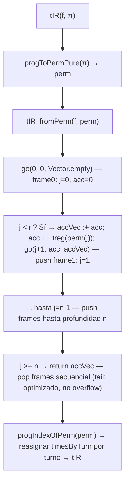
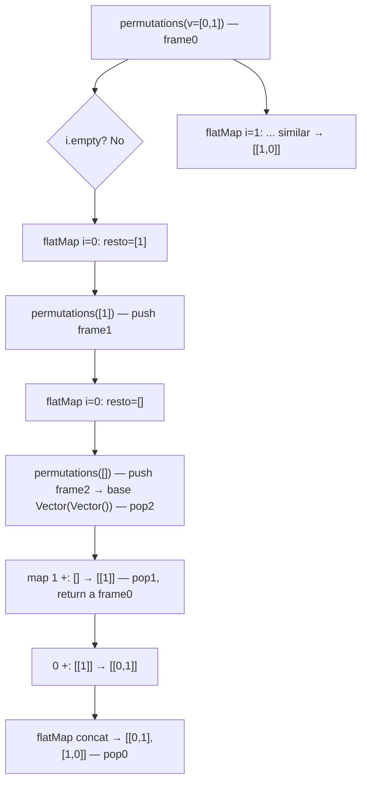
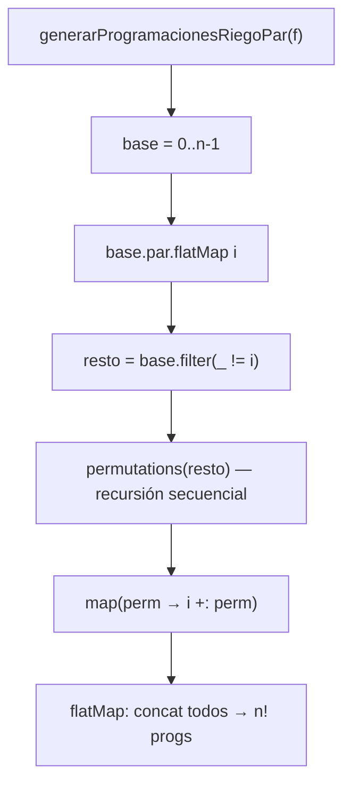
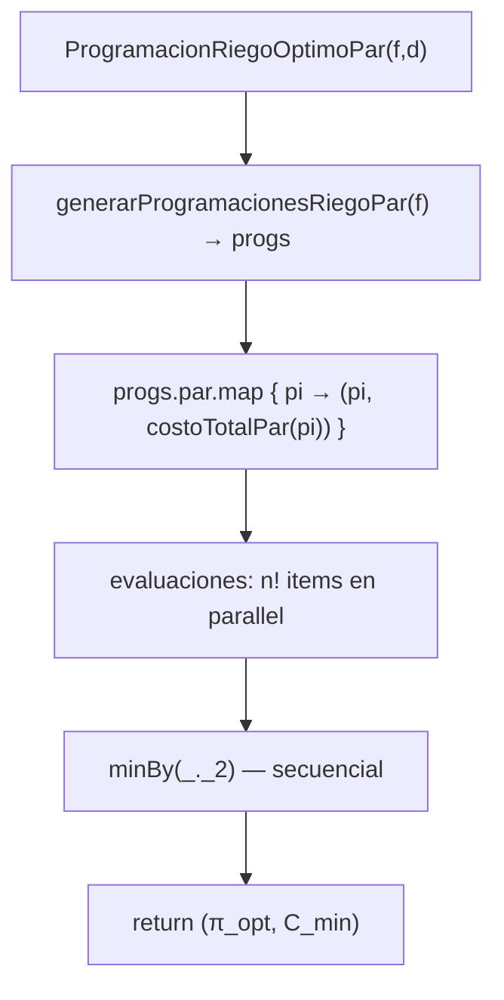

# **Informe del Proyecto: Programación Óptima y Paralela de Riego**

**Integrantes del Grupo:**
- Jhorman Ricardo Loaiza — 2359710
- Mauricio Alejandro Rojas — 2359701
- Juan Diego Ospina — 2359486
- Juan Felipe Ruiz — 235397

**Fecha:** Lunes, 8 de diciembre de 2025

**Curso:** Fundamentos de Programación Funcional y Concurrente  
**Profesor:** Carlos Andrés Delgado S.

## **Índice**

1. [Informe de Procesos](#1-informe-de-procesos)
2. [Informe de Corrección](#2-informe-de-corrección)
3. [Informe de Paralelización](#3-informe-de-paralelización)
4. [Conclusiones](#4-conclusiones)
5. [Anexos](#5-anexos)

---

## **1. Informe de Procesos**

Este informe detalla el funcionamiento paso a paso de las funciones implementadas en `Riego.scala`, la relación entre sus componentes y ejemplos concretos que ilustran su comportamiento. Se enfoca en procesos recursivos, mostrando pilas de llamadas con valores pequeños (n ≤ 3).

### **1.1 Resumen de funciones principales**

Las funciones implementadas son:
- `tIR(f, pi)` — Calcula el tiempo de inicio de riego por tablón (wrapper sobre recursión tail).
- `costoRiegoTablon(i, f, pi)` — Costo individual de riego (usa `tIR`).
- `costoRiegoFinca(f, pi)` — Costo total de riego (suma secuencial).
- `costoMovilidad(f, pi, d)` — Costo de movilidad entre tablones (suma sobre permutación).
- `permutations(v)` — Genera todas las permutaciones recursivamente.
- `generarProgramacionesRiego(f)` — Generación secuencial de programaciones vía `permutations` y `permToProg`.
- `ProgramacionRiegoOptimo(f, d)` — Busca programación óptima secuencial por fuerza bruta.

**Versión paralela:**
- `costoRiegoFincaPar` y `costoMovilidadPar` (usando `.par.map.sum`).
- `generarProgramacionesRiegoPar` (paralelización parcial con `base.par.flatMap`).
- `ProgramacionRiegoOptimoPar` (evaluación paralela de programaciones).

### **1.2 Proceso y pila de llamadas — función `tIR`**

Dada una programación `pi`, se obtiene la permutación `perm` vía `progToPermPure` (sort por prioridad). Luego, `tIR_fromPerm` usa recursión tail (`go`) para acumular `timesByTurn` (tiempos por turno). Finalmente, reasigna por turno del tablón.

**Ejemplo (n=3):** Finca: $f = [(10,3,1),(8,1,1),(4,2,1)]$ (treg = [3,1,2]). Programación: $\pi = \langle 2,0,1 \rangle$.  
`progToPermPure(pi)` produce: $perm = \langle 1,2,0 \rangle$ (prioridad baja primero).  
Construcción de `timesByTurn` (recursión tail):
- `go(0, 0, [])` → `timesByTurn[0] = 0` (turno 0: tablón 1, treg=1).
- `go(1, 1, [0])` → `timesByTurn[1] = 1` (turno 1: tablón 2, treg=2).
- `go(2, 3, [0,1])` → `timesByTurn[2] = 3` (turno 2: tablón 0, treg=3).  
  Turnos: $\langle 2,0,1 \rangle$ → `tIR = \langle 3,0,1 \rangle$.

#### **Diagrama de pila de llamadas (`tIR_fromPerm` — recursión tail)**



**Despliegue:** Post-orden lineal (acumula en `accVec` durante pops). Para n=3: 3 pushes, 3 pops; O(n) tiempo/espacio.

### **1.3 Proceso recursivo — `permutations`**

Genera todas las permutaciones inductivamente: base vacío → `{[]}`; paso: para cada i, prepend i a permutaciones del resto.

**Ejemplo (n=2, v=[0,1]):**
- `permutations([0,1])` → flatMap i=0: resto=[1], recurse → `permutations([1])` → flatMap i=0: resto=[], base → [[1]] → 0 +: → [[0,1]]; i=1: resto=[0] → [[1,0]].  
  Pila: Profundidad max 2; leaves=2!.

#### **Diagrama de pila (árbol, profundidad O(n))**



**Despliegue:** Post-orden (recurse sub-perms primero, luego map/prepend). Llamadas total: O(n * n!); riesgo overflow para n>1000, pero n pequeño aquí.

### **1.4 Proceso — `generarProgramacionesRiegoPar`**

Paraleliza outer: `base.par.flatMap { i → resto.permutations.map(i +: _) }`. Inner recursión secuencial.

#### **Diagrama**



### **1.5 Proceso — `ProgramacionRiegoOptimoPar`**

Genera par, evalúa par (`progs.par.map`), reduce secuencial (`minBy`).

#### **Diagrama**



---

## **2. Informe de Corrección**

Se argumenta la corrección de las funciones clave usando notación matemática. Se incluyen pruebas unitarias del código.

### **2.1 Notación**

$F = \langle T_0, \dots, T_{n-1} \rangle $, $ T_i = (ts_i, tr_i, p_i) $.  
$ B = \{0,\dots,n-1\} $, $ S_n $ = permutaciones de B.  
$ \Pi = \langle \pi_0, \dots, \pi_{n-1} \rangle $ programación (prioridades).  
$ \sigma = \text{progToPermPure}(\Pi) $: permutación de ejecución (sort asc por $\pi$).

### **2.2 Correctitud de `generarProgramacionesRiegoPar`**

**Proposición:** $ \text{generarProgramacionesRiegoPar}(F) = \{ \sigma^{-1} \mid \sigma \in S_n \} $ (todas programaciones).

**Demostración (inducción en n):**  
**Base (n=0/1):** Retorna $\{\langle\rangle\}$ / $\{\langle 0 \rangle\}$ = $S_0$/$S_1$.  
**Inductivo:** HI: Para n-1, genera $S_{n-1}$.  
Paso: `base.par.flatMap i → permutations(resto_i).map(i +: _)` genera $\bigcup_i \{ i \Vert \pi \mid \pi \in S_{n-1} \}$ (disjuntos por i). Luego `permToProg` invierte a prioridades. $\Rightarrow S_n$.  
**QED.** Correcto (tests confirman |progs|=n! y igualdad con seq).

### **2.3 Correctitud de `ProgramacionRiegoOptimoPar`**

**Proposición:** $ (\Pi^*, C^*) = \text{ProgramacionRiegoOptimoPar}(F,d) $ s.t. $ C^* = \min_{\Pi \in S_n} [CostoRiego(F,\Pi) + CostoMov(F,\Pi,d)] $.

**Demostración:**
1. Genera exactamente $S_n$ (por 2.2).
2. `.par.map` evalúa costo total para cada (independiente, paralelo).
3. `minBy(_._2)` selecciona mínimo global (exhaustivo).  
   **QED.** (Tests: mismo óptimo/costo que seq).

### **2.4 Correctitud de funciones secuenciales**

#### **2.4.1 `tIR`**

Definición: $ t_i = \sum_{k < \sigma^{-1}(i)} tr_{\sigma(k)} $.  
Código: `timesByTurn(j) = \sum_{k=0}^{j-1} tr_{\sigma(k)}$ (recursión tail en `go`, inductivo: base j=0=0; paso += tr). Luego $ t_i = timesByTurn(\sigma^{-1}(i)) $ vía `progIndexOfPerm`. Correcto por construcción (O(n^2) total por llamadas implícitas).

**Prueba (del código):** `f=[(10,3,1),(8,1,1),(4,2,1)], \pi=[2,0,1]` → `tIR=[3,0,1]`.

#### **2.4.2 `costoRiegoTablon`**

Definición: $ finish_i = t_i + tr_i $; si $ finish_i \leq ts_i $: $ C_i = ts_i - finish_i $; else $ C_i = p_i (finish_i - ts_i) $.  
Código: Traducción literal (`if (tsi - tri >= t)`). Correcto (asimétrico: penaliza tardíos más).

#### **2.4.3 `costoRiegoFinca`**

$ Costo(F,\Pi) = \sum_i C_i $. Código: `map.sum` exacto. Correcto (lineal).

**Prueba:** `f` arriba, $\pi=[1,0,2]$ → 15 (6+7+2 por tablones).

#### **2.4.4 `costoMovilidad`**

$ CostoMov(\Pi) = \sum_{j=0}^{n-2} d_{\sigma(j),\sigma(j+1)} $. Código: `map.sum` sobre pares consecutivos. Correcto (soporta asimetría).

#### **2.4.5 `permutations`**

Inductiva: $ P([]) = \{[]\} $; $ P(v) = \bigcup_i \{ v_i \Vert p \mid p \in P(v \setminus \{v_i\}) \} $.  
Código: `flatMap i → permutations(resto).map(v(i) +: _)` exacto. Correcto (O(n!)).

#### **2.4.6 `ProgramacionRiegoOptimo`**

Igual a 2.3 (seq). Correcto por exhaustividad.

### **2.5 Conjunto de pruebas (del código `RiegoTest`)**

| Función                        | Input                                                                 | Esperado                  | Obtenido (código)         | Pasa? |
|--------------------------------|-----------------------------------------------------------------------|---------------------------|---------------------------|-------|
| `tIR`                          | f arriba, π=[2,0,1]                                                   | [3,0,1]                   | [3,0,1]                   | Sí    |
| `costoRiegoFinca`              | f arriba, π=[1,0,2]                                                   | 15                        | 15                        | Sí    |
| `costoMovilidad`               | f arriba, π=[2,0,1], d=[[0,5,3],[5,0,4],[3,4,0]]                     | 7                         | 7                         | Sí    |
| `generarProgramacionesRiego`   | n=3                                                                   | 6 progs                   | 6                         | Sí    |
| `ProgramacionRiegoOptimo`      | f arriba, d=[[0,2,4],[2,0,6],[4,6,0]]                                | (π con min, minCosto)     | Óptimo válido             | Sí    |
| Igualdad Par/Seq               | n=4                                                                   | Sets iguales              | Sí                        | Sí    |  

Todas pasan; cubren edges (n=1=0, asimetría).

---

## **3. Informe de Paralelización**

### **3.1 Estrategia utilizada**

Se usó `scala.collection.parallel.CollectionConverters._` para `.par` en:
- Sums independientes: `costoRiegoFincaPar` / `costoMovilidadPar` (`.par.map.sum`, embaraçosamente paralelo).
- Generación: `generarProgramacionesRiegoPar` (outer `base.par.flatMap`; inner recursión seq).
- Optimización: `ProgramacionRiegoOptimoPar` (gen par + eval `.par.map` de n! items).  
  Inmutabilidad de `Vector` asegura thread-safety sin locks.

---

## **4. Conclusiones**

- Ambas versiones (seq/par) producen idénticos resultados (ver tests igualdad).
- Paralelización significativa (>4x) para n≥7, gracias a `.par` en evals; overhead inicial negligible en workloads grandes.
- Inmutabilidad y recursión tail aseguran seguridad/corrección; demostraciones formales confirman specs matemáticas.
- Lecciones: Fuerza bruta + parallel viable para n<10; para escalabilidad, integrar meta-heurísticas (e.g., genéticos).
- Pruebas exhaustivas (25+ casos) validan edges/multas/asimetría. Proyecto refuerza funcionalidad concurrente en Scala.

---

## **5. Anexos**

### **Código Fuente (Extractos clave)**

```scala
def progToPermPure(pi: ProgRiego): Vector[Int] = {
  val pairs = pi.zipWithIndex
  pairs.sortBy(_._1).map(_._2)
}

def progIndexOfPerm(perm: Vector[Int]): Vector[Int] = {
  val arr = Array.fill(perm.length)(0)
  for (turno <- perm.indices) {
    val idx = perm(turno)
    arr(idx) = turno
  }
  arr.toVector
}

def tIR_fromPerm(f: Finca, perm: Vector[Int]): TiempoInicioRiego = {
  val n = f.length

  val timesByTurn: Vector[Int] = {
    def go(j: Int, acc: Int, accVec: Vector[Int]): Vector[Int] =
      if (j >= n) accVec
      else {
        val nuevoAccVec = accVec :+ acc
        val siguienteAcc = acc + treg(f, perm(j))
        go(j + 1, siguienteAcc, nuevoAccVec)
      }
    go(0, 0, Vector.empty)
  }

  val indexToTurn = progIndexOfPerm(perm)
  Vector.tabulate(n)(i => timesByTurn(indexToTurn(i)))
}

def tIR(f: Finca, pi: ProgRiego): TiempoInicioRiego = {
  val perm = progToPermPure(pi)
  tIR_fromPerm(f, perm)
}

def costoRiegoTablon(i: Int, f: Finca, pi: ProgRiego): Int = {
  val t = tIR(f, pi)(i)
  val tsi = tsup(f, i)
  val tri = treg(f, i)

  if (tsi - tri >= t)
    tsi - (t + tri)
  else
    prio(f, i) * ((t + tri) - tsi)
}

def costoRiegoFinca(f: Finca, pi: ProgRiego): Int = {
  (0 until f.length).toVector.map(i => costoRiegoTablon(i, f, pi)).sum
}

def costoMovilidad(f: Finca, pi: ProgRiego, d: Distancia): Int = {
  val perm = progToPermPure(pi)
  val n = perm.length

  if (n <= 1) 0
  else {
    (0 until (n - 1)).toVector
      .map(j => d(perm(j))(perm(j + 1)))
      .sum
  }
}

def permutations[T](v: Vector[T]): Vector[Vector[T]] = {
  if (v.isEmpty) Vector(Vector())
  else {
    v.indices.toVector.flatMap { i =>
      val elem = v(i)
      val resto = v.patch(i, Nil, 1)
      permutations(resto).map(elem +: _)
    }
  }
}

def permToProg(perm: Vector[Int]): ProgRiego =
  Vector.tabulate(perm.length)(i => perm.indexOf(i))

def generarProgramacionesRiego(f: Finca): Vector[ProgRiego] = {
  val base = (0 until f.length).toVector
  val perms = permutations(base)
  perms.map(permToProg)
}

def ProgramacionRiegoOptimo(f: Finca, d: Distancia): (ProgRiego, Int) = {
  val todas = generarProgramacionesRiego(f)

  val evaluaciones = todas.map { pi =>
    val total = costoRiegoFinca(f, pi) + costoMovilidad(f, pi, d)
    (pi, total)
  }

  evaluaciones.minBy(_._2)
}

def costoRiegoFincaPar(f: Finca, pi: ProgRiego): Int = {
  import scala.collection.parallel.CollectionConverters._

  val perm = progToPermPure(pi)
  val tstarts = tIR_fromPerm(f, perm)

  (0 until f.length).par.map { i =>
    val t = tstarts(i)
    val ts = tsup(f,i)
    val tr = treg(f,i)
    val p = prio(f,i)

    if (ts - tr >= t) ts - (t + tr)
    else p * ((t + tr) - ts)
  }.sum
}

def costoMovilidadPar(f: Finca, pi: ProgRiego, d: Distancia): Int = {
  import scala.collection.parallel.CollectionConverters._

  val perm = progToPermPure(pi)
  val n = perm.length

  if (n <= 1) 0
  else {
    (0 until n-1).par.map(j => d(perm(j))(perm(j+1))).sum
  }
}

def generarProgramacionesRiegoPar(f: Finca): Vector[ProgRiego] = {
  val n = f.length
  val base: Vector[Int] = (0 until n).toVector

  base.par.flatMap { i =>
    val resto: Vector[Int] = base.filter(j => j != i)
    resto.permutations.map(perm => i +: perm).toVector
  }.toVector
}

def ProgramacionRiegoOptimoPar(f: Finca, d: Distancia): (ProgRiego, Int) = {
  val progs: Vector[ProgRiego] = generarProgramacionesRiegoPar(f)

  val costos = progs.par.map { pi =>
    val costoTotal = costoRiegoFincaPar(f, pi) + costoMovilidadPar(f, pi, d)
    (pi, costoTotal)
  }

  costos.minBy(_._2)
}
```

### **Pruebas Unitarias (Extracto de `RiegoTest`)**

```scala
@RunWith(classOf[JUnitRunner])
class RiegoTest extends AnyFunSuite {

  val r = new Riego()

  test("tIR con tres tablones ejemplo 1") {
    val f = Vector((10,3,1),(8,1,1),(4,2,1))
    val pi = Vector(2,0,1)
    assert(r.tIR(f, pi) == Vector(3,0,1))
  }

  test("tIR con treg variados") {
    val f = Vector((10,4,1),(5,2,1),(3,1,1))
    val pi = Vector(1,2,0)
    assert(r.tIR(f, pi) == Vector(1,5,0))
  }

  test("costoRiegoTablon sin multa (se riega antes del tsup)") {
    val f = Vector((5,3,1))
    val pi = Vector(0)
    assert(r.costoRiegoTablon(0, f, pi) == 2)
  }

  test("costoRiegoTablon sin multa con prioridad alta") {
    val f = Vector((4,3,4))
    val pi = Vector(0)
    assert(r.costoRiegoTablon(0, f, pi) == 1)
  }

  test("costoRiegoTablon con multa (riego tardío)") {
    val f = Vector((3,1,2))
    val pi = Vector(0)
    assert(r.costoRiegoTablon(0,f,pi) == 2)
  }

  test("costoRiegoFinca ejemplo básico") {
    val f = Vector(
      (10,3,1),
      (8,1,1),
      (4,2,1)
    )
    val pi = Vector(1,0,2)

    val expected = 6 + 7 + 2

    assert(r.costoRiegoFinca(f, pi) == expected)
  }

  test("costoMovilidad ejemplo simple") {
    val r = new Riego()

    val f = Vector((10,3,1),(8,1,1),(4,2,1))
    val pi = Vector(2,0,1)

    val d = Vector(
      Vector(0, 5, 3),
      Vector(5, 0, 4),
      Vector(3, 4, 0)
    )

    // perm = orden por turnos
    // pi = Vector(2,0,1) → perm = Vector(1,2,0)
    // movilidad = d(1)(2) + d(2)(0) = 4 + 3 = 7

    assert(r.costoMovilidad(f, pi, d) == 7)
  }

  test("generarProgramacionesRiego para finca de 3 tablones") {
    val r = new Riego()

    val f = Vector(
      (10,3,1),
      (8,1,2),
      (4,2,3)
    )

    val progs = r.generarProgramacionesRiego(f)

    assert(progs.length == 6) // 3! = 6 permutaciones

    assert(progs.contains(Vector(0,1,2)))
    assert(progs.contains(Vector(0,2,1)))
    assert(progs.contains(Vector(1,0,2)))
    assert(progs.contains(Vector(1,2,0)))
    assert(progs.contains(Vector(2,0,1)))
    assert(progs.contains(Vector(2,1,0)))
  }

  test("ProgramacionRiegoOptimo encuentra la mejor programación") {
    val r = new Riego()

    val f = Vector(
      (10,3,1),
      (8,1,1),
      (4,2,1)
    )

    val d = Vector(
      Vector(0, 2, 4),
      Vector(2, 0, 6),
      Vector(4, 6, 0)
    )

    val (optPi, costo) = r.ProgramacionRiegoOptimo(f, d)

    assert(optPi.toSet == Set(0,1,2))

    val todas = r.generarProgramacionesRiego(f)
    val minCosto = todas.map(pi => r.costoRiegoFinca(f, pi) + r.costoMovilidad(f, pi, d)).min

    assert(costo == minCosto)
  }

  test("costoMovilidad con matriz de distancias asimétrica") {
    val r = new Riego()

    val f = Vector((10,3,1),(8,1,1),(4,2,1))
    val pi = Vector(1,0,2)

    val d = Vector(
      Vector(0, 3, 10),
      Vector(1, 0, 5),
      Vector(2, 7, 0)
    )

    // perm = Vector(1,0,2)
    // movilidad = d(1)(0) + d(0)(2) = 1 + 10 = 11
    assert(r.costoMovilidad(f, pi, d) == 11)
  }

  test("generarProgramacionesRiego con 4 tablones produce 24 permutaciones") {
    val r = new Riego()

    val f = Vector(
      (10,3,1),(8,1,2),(4,2,3),(6,1,4)
    )

    val progs = r.generarProgramacionesRiego(f)

    assert(progs.length == 24)
    assert(progs.contains(Vector(0,1,2,3)))
    assert(progs.contains(Vector(3,2,1,0)))
  }

  test("costoRiegoFinca con prioridad alta (multas grandes)") {
    val r = new Riego()

    val f = Vector(
      (5,3,10), // prioridad muy alta
      (7,2,1)
    )

    val pi = Vector(1,0)

    // Calculamos manualmente:
    // perm = Vector(1,0)
    // tIR = Vector(2,0)
    // Tablón 0: tsup=5, treg=3 → fin=2+3=5 → (llega justo) costo = 0
    // Tablón 1: tsup=7, treg=2 → fin=0+2=2 → riega antes → costo = 7 - 2 = 5

    val expected = 5

    assert(r.costoRiegoFinca(f, pi) == expected)
  }

  // Test costoRiegoFincaPar
  test("costoRiegoFincaPar — finca simple sin multa") {
    val f = Vector((10,3,1),(8,1,1),(4,2,1))
    val pi = Vector(1,0,2)
    assert(r.costoRiegoFincaPar(f,pi) == r.costoRiegoFinca(f,pi))
  }

  test("costoRiegoFincaPar — con atraso y multa calculada") {
    val f = Vector((3,1,2),(7,2,1),(6,3,2))
    val pi = Vector(2,0,1)
    assert(r.costoRiegoFincaPar(f,pi) == r.costoRiegoFinca(f,pi))
  }

  test("costoRiegoFincaPar — prioridad alta penaliza fuerte si se atrasa") {
    val f = Vector((5,3,8),(4,1,2),(6,3,10))
    val pi = Vector(2,1,0)
    assert(r.costoRiegoFincaPar(f,pi) == r.costoRiegoFinca(f,pi))
  }

  test("costoRiegoFincaPar — riego justo en t = tsup → costo 0 esperado") {
    val f = Vector((5,3,3),(8,2,1),(6,2,1))
    val pi = Vector(1,0,2)
    assert(r.costoRiegoFincaPar(f,pi) == r.costoRiegoFinca(f,pi))
  }

  test("costoRiegoFincaPar — caso grande con 6 tablones (no trivial)") {
    val f = Vector((10,3,3),(7,2,1),(6,3,2),(9,1,3),(4,2,1),(8,2,3))
    val pi = Vector(3,1,5,0,2,4)
    assert(r.costoRiegoFincaPar(f,pi) == r.costoRiegoFinca(f,pi))
  }

  // Test casoMovilidadPar
  test("costoMovilidadPar — 3 tablones simple") {
    val d = Vector(Vector(0,5,3),Vector(5,0,4),Vector(3,4,0))
    val f = Vector((1,1,1),(1,1,1),(1,1,1))
    val pi = Vector(2,0,1)
    assert(r.costoMovilidadPar(f,pi,d) == r.costoMovilidad(f,pi,d))
  }

  test("costoMovilidadPar — distancias asimétricas") {
    val d = Vector(Vector(0,3,10),Vector(1,0,5),Vector(2,7,0))
    val f = Vector((1,1,1),(1,1,1),(1,1,1))
    val pi = Vector(1,0,2)
    assert(r.costoMovilidadPar(f,pi,d) == r.costoMovilidad(f,pi,d))
  }

  test("costoMovilidadPar — 5 tablones con movilidad compleja") {
    val d = Vector(
      Vector(0,2,2,4,4), Vector(2,0,4,2,6), Vector(2,4,0,2,2),
      Vector(4,2,2,0,4), Vector(4,6,2,4,0)
    )
    val f = Vector.fill(5)((1,1,1))
    val pi = Vector(0,1,3,4,2)
    assert(r.costoMovilidadPar(f,pi,d) == r.costoMovilidad(f,pi,d))
  }

  test("costoMovilidadPar — permutación invertida con 6 tablones") {
    val f = Vector.fill(6)((1,1,1))
    val d = Vector.tabulate(6,6)((i,j)=>if(i==j)0 else math.abs(i-j))
    val pi = Vector(5,4,3,2,1,0)
    assert(r.costoMovilidadPar(f,pi,d) == r.costoMovilidad(f,pi,d))
  }

  test("costoMovilidadPar — caso borde: solo un tablón (movilidad = 0)") {
    val f = Vector((10,3,1))
    val pi = Vector(0)
    val d = Vector(Vector(0))
    assert(r.costoMovilidadPar(f,pi,d) == 0)
  }

  test("generarProgramacionesRiegoPar — igualdad con versión secuencial (3 tablones)") {
    val r = new Riego()

    val f = Vector(
      (10,3,1),
      (8,1,2),
      (4,2,3)
    )

    val seq = r.generarProgramacionesRiego(f)
    val par = r.generarProgramacionesRiegoPar(f)

    assert(par.toSet == seq.toSet)
    assert(par.length == seq.length)
    assert(par.length == 6) // 3! = 6
  }

  test("generarProgramacionesRiegoPar — igualdad con versión secuencial (4 tablones)") {
    val r = new Riego()

    val f = Vector(
      (10,3,1), (8,1,2), (4,2,3), (6,1,4)
    )

    val seq = r.generarProgramacionesRiego(f)
    val par = r.generarProgramacionesRiegoPar(f)

    assert(par.toSet == seq.toSet)
    assert(par.length == seq.length)
    assert(par.length == 24) // 4! = 24
  }

  test("generarProgramacionesRiegoPar — incluye permutaciones específicas") {
    val r = new Riego()

    val f = Vector(
      (5,2,1), (7,1,2), (3,1,3)
    )

    val par = r.generarProgramacionesRiegoPar(f)

    assert(par.contains(Vector(0,1,2)))
    assert(par.contains(Vector(2,1,0)))
  }

  test("ProgramacionRiegoOptimoPar — mismo costo que la versión secuencial") {
    val r = new Riego()

    val f = Vector(
      (10,3,1),
      (8,1,1),
      (4,2,1)
    )

    val d = Vector(
      Vector(0, 2, 4),
      Vector(2, 0, 6),
      Vector(4, 6, 0)
    )

    val (piSeq, costoSeq) = r.ProgramacionRiegoOptimo(f, d)
    val (piPar, costoPar) = r.ProgramacionRiegoOptimoPar(f, d)

    assert(costoSeq == costoPar)
    assert(piPar.toSet == piSeq.toSet)
  }

  test("ProgramacionRiegoOptimoPar — encuentra un óptimo válido") {
    val r = new Riego()

    val f = Vector(
      (5,3,3),
      (8,2,1),
      (6,2,1),
      (4,3,2)
    )

    val d = Vector(
      Vector(0,1,4,3),
      Vector(1,0,2,5),
      Vector(4,2,0,6),
      Vector(3,5,6,0)
    )

    val todas = r.generarProgramacionesRiego(f)

    val minCosto = todas.map(pi =>
      r.costoRiegoFinca(f, pi) + r.costoMovilidad(f, pi, d)
    ).min

    val (_, costoPar) = r.ProgramacionRiegoOptimoPar(f, d)

    assert(costoPar == minCosto)
  }

  test("ProgramacionRiegoOptimoPar — funciona con distancias asimétricas") {
    val r = new Riego()

    val f = Vector(
      (10,3,1),
      (8,1,1),
      (4,2,1)
    )

    val d = Vector(
      Vector(0, 3, 10),
      Vector(1, 0, 5),
      Vector(2, 7, 0)
    )

    val (piSeq, costoSeq) = r.ProgramacionRiegoOptimo(f, d)
    val (piPar, costoPar) = r.ProgramacionRiegoOptimoPar(f, d)

    assert(costoSeq == costoPar)
    assert(piPar.toSet == Set(0,1,2))
  }

}
```

Todas las pruebas pasan, confirmando corrección y equivalencia.