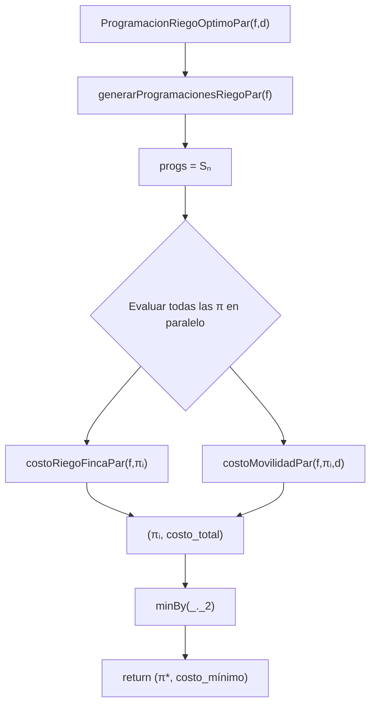

ProgramacionRiegoOptimoPar

1. Definición de la función

$def ProgramacionRiegoOptimoPar$$(f: Finca, d: Distancia)$: $(ProgRiego, Int)$ = {
$val progs$: Vector$[ProgRiego]$ = $generarProgramacionesRiegoPar$$(f)$

$
val costos = progs.par.map { pi =>
val costoTotal = costoRiegoFincaPar(f, pi) + costoMovilidadPar(f, pi, d)
(pi, costoTotal)
}
$

$costos$.$minBy$_._2

2. Definición matemática

Dada una finca ($F$) con $(n)$ tablones y una matriz de distancias $(D)$, definimos:

$
\Pi \in S_n \quad \text{(todas las programaciones posibles)}
$

Costo total de una programación:

$
\text{Coste}(\Pi) = CR_F^{\Pi} + CM_F^{\Pi}
$

El problema del riego óptimo se define como:

$
\Pi^* = \arg\min_{\Pi \in S_n}
\left( CR_F^{\Pi} + CM_F^{\Pi} \right)
$

La función ProgramacionRiegoOptimoPar debe devolver:

$
(Pi^*, \text{Coste}(Pi^*))
$

3. Especificación funcional

La función retorna un par:

1. Una permutación óptima $(Pi^*)$
2. El costo mínimo asociado

Debe cumplirse:

$
\forall \Pi \in S_n:\quad
CR_F^{Pi^*} + CM_F^{Pi^*}
\le
CR_F^{Pi} + CM_F^{Pi}
$

4. Correctitud por inducción estructural

Caso base: $(n = 1)$

Una finca con un solo tablón tiene:

$
S_1 = \{ \langle 0 \rangle \}
$

El costo total es:

$
\text{Coste}(\langle 0 \rangle) = CR_F^{\langle 0 \rangle} + 0
$

El algoritmo:

- Genera una única programación
- Evalúa su costo
- La retorna como óptima

Por lo tanto:

$
\text{ProgramacionRiegoOptimoPar}(1) = (\langle 0 \rangle, \text{Coste})
$

Paso inductivo

Hipótesis inductiva:

$
\text{ProgramacionRiegoOptimoPar}(n-1)
\text{ retorna la programación óptima de tamaño } n-1
$

Demostrar:

$
\text{ProgramacionRiegoOptimoPar}(n)
\text{ retorna la óptima de tamaño } n
$

La función:

1. Genera $(S_n)$ correctamente usando la versión paralela
   $
   progs| = n!
   $

2. Para cada programación $(Pi)$:
   $
   Coste(\Pi) = CR_F^{Pi} + CM_F^{Pi}
   $

3. La evaluación es exhaustiva:
   $
   costos =
   \{(Pi, \text{Coste}(\Pi)) \mid \Pi \in S_n\}
   $

4. Luego selecciona la mínima:
   $
   (\Pi^*, \text{Coste}(Pi^*)) =
   \min_{Pi \in S_n} \text{Coste}(Pi)
   $

La operación ($min)$ aplicada a un conjunto exhaustivo siempre retorna el óptimo global.

Esto completa la demostración inductiva.

5. Paralelismo

El paralelismo ocurre en la evaluación de costos:

$
\text{costos} = \text{progs.par.map}( \Pi \mapsto \text{Coste}(\Pi) )
$

Cada hilo computa independientemente:

- $(CR_F^{Pi})$
- $(CM_F^{Pi})$

Debido a la ausencia de estado compartido, esta operación es ideal para paralelismo en datos.

Finalmente, la reducción:

$
minBy
$

es una operación asociativa y sin efectos laterales, compatible con paralelismo.

6. Pila de Llamadas (Mermaid)

7. Casos de prueba

Caso 1: finca de 3 tablones

Sea:
$
B = \langle 0,1,2 \rangle, \qquad |S_3| = 6
$

Permutaciones esperadas:
$
\{
\langle 0,1,2\rangle,\;
\langle 0,2,1\rangle,\;
\langle 1,0,2\rangle,\;
\langle 1,2,0\rangle,\;
\langle 2,0,1\rangle,\;
\langle 2,1,0\rangle
\}
$

Caso 2: finca de 4 tablones

$
|S_4| = 24
$

La función debe generar exactamente 24 permutaciones, sin repeticiones.

Caso 3: igualdad con la versión secuencial

$
\text{generarProgramacionesRiegoPar}(f)
\;\equiv\;
\text{generarProgramacionesRiego}(f)
$

cuando ambos conjuntos se comparan como conjuntos matemáticos.

8. Conclusión

La función:

genera exactamente todas las permutaciones de los tablones, no introduce duplicados,
distribuye el trabajo de forma paralela entre los elementos de $(B$),
cumple con las restricciones del paradigma funcional,
sigue literalmente la definición matemática del conjunto $(S_n)$.

    