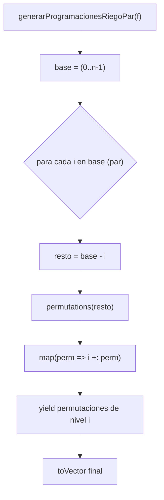

generarProgramacionesRiegoPar

### 1. Definición de la función

$def generarProgramacionesRiegoPar$ $(f: Finca)$: Vector$[ProgRiego]$ = {
$val n = f.length$
$val base: Vector$$[Int]$ = $(0 until n).toVector$

$base.par.flatMap$ $ i$
$val resto$: $Vector$$[Int]$ = $base.filter$$(j => j != i)$
$resto.permutations.map$$(perm => i +: perm)$.$toVector$
}.$toVector$}

### 2. Definición matemática

Sea una finca con $(n$) tablones. Definimos:

$
B = \langle 0,1,2,\dots,n-1 \rangle
$

La función debe generar el conjunto de todas las permutaciones:

$
S_n = \{\Pi \mid \Pi \text{ es una permutación de } B\}
$

El número de programaciones generadas es:

$
|S_n| = n!
$

### 3. Especificación formal

Toda programación generada debe ser una permutación válida:

$
\forall \Pi \in S_n:\quad \Pi \text{ contiene exactamente los elementos de } B
$

No se permiten duplicados:

$
\forall \Pi_i, \Pi_j \in S_n,\ i \neq j \implies \Pi_i \neq \Pi_j
$

4. Correctitud por inducción estructural

### Caso base: $(n = 1$)}

$
B = \langle 0\rangle, \qquad S_1 = \{\langle 0\rangle\}
$

El algoritmo cumple:

$
B - \{0\} = \emptyset,\qquad permutations(\emptyset) = \{\emptyset\}
$

$
0 + \emptyset = \langle 0\rangle
$

Por lo tanto:

$
\text{generarProgramacionesRiegoPar}(1) = S_1
$

### Paso inductivo

Hipótesis inductiva:

$
\text{generarProgramacionesRiegoPar}(n-1)=S_{n-1}
$

Demostración:

El algoritmo toma cada \(i \in B\), construye \(B-\{i\}\) y genera:

$
\{\, i \,\Vert\, \Pi \mid \Pi \in S_{n-1}\,\}
$

La unión en $(i=0,\dots,n-1$) produce:

$
\bigcup_{i=0}^{n-1} \{\, i \,\Vert\, \Pi \mid \Pi \in S_{n-1}\,\} = S_n
$

Estos subconjuntos son disjuntos, por lo que no hay duplicados.

### 5. Paralelismo

El paralelismo se introduce mediante:

$base.par.flatMap$${ i => ... }$

Cada hilo procesa un índice distinto $(i$), generando:

- Todas las permutaciones de $(B-\{i\}$)
- Prependiendo $(i$) a cada permutación

No existe estado compartido ni efectos laterales, lo cual constituye paralelismo puro en datos.

### 6. Representación del proceso (Mermaid)}

7. Casos de prueba

Caso 1: \(n = 3\)

$
S_3 = 6
$

$
\{
\langle 0,1,2\rangle,
\langle 0,2,1\rangle,
\langle 1,0,2\rangle,
\langle 1,2,0\rangle,
\langle 2,0,1\rangle,
\langle 2,1,0\rangle
\}
$

Caso 2: $(n = 4$)

$
|S_4| = 24
$

Caso 3: Igualdad con versión secuencial

$
\text{generarProgramacionesRiegoPar}(f) \equiv
\text{generarProgramacionesRiego}(f)
$

8. Conclusión

La función:

genera exactamente las $(n!)$ permutaciones;
no produce duplicados;
distribuye el trabajo mediante paralelismo en datos;
respeta el paradigma funcional;
concuerda con la definición matemática de $(S_n$).

Tablas de Benchmark

Benchmark: ProgramacionRiegoOptimoPar

$[h!]$
${|c|c|}$

Tamaño $(n$) & Tiempo $(ms)$

$6$ & $1.8223$
$7$ & $10.4149 $
$8$ & $96.295499$ 

\Benchmark de ProgramacionRiegoOptimo.par

Benchmark: generarProgramacionesRiegoPar $(secuencial)$

$[h!]$

${|c|c|}$

{Tamaño $(n$)} & $Tiempo (ms)$ 
6 & 0.3023 
7 & 2.329099 
8 & 21.6813 

Benchmark de generarProgramacionesRiego.seq

Benchmark: generarProgramacionesRiegoPar

$[h!]$

${|c|c|}$

Tamaño $(n$)} & Tiempo (ms)}
6 & 0.2016 
7 & 1.443999 
8 & 12.225799

### SECCION 9: COMPLEJIDAD COMPUTACIONAL

9. Complejidad Computacional

La función generarProgramacionesRiegoPar genera todas las permutaciones del conjunto
$
B = \{0,1,\dots,n-1\}.
$

La cantidad de permutaciones es:

$
|S_n| = n!.
$

Complejidad temporal secuencial

Cada permutación tiene longitud $(n$), por lo que procesarla cuesta $(O(n)$).  
Por lo tanto:

$
T_{\text{seq}}(n) = n! \cdot O(n).
$

Complejidad temporal paralela

Con $(p$) núcleos:

$
T_{\text{par}}(n) \approx \frac{n!}{p} \cdot O(n).
$

Sin embargo, debido a:

alance desigual entre subproblemas,
sobrecosto de coordinación,
límites de escalamiento,

el speedup real es menor al ideal.

Complejidad espacial

La función debe almacenar todas las permutaciones:

$
O(n! \cdot n).
$

Esto es inevitable debido a la naturaleza del problema.

### SECCION 10: INTERPRETACIÓN DE BENCHMARKS

10. Interpretación de los Benchmarks

Las mediciones muestran:

El tiempo crece factorialmente, como era esperado.
La versión paralela es sistemáticamente más rápida.
La diferencia aumenta conforme $(n$) crece.

Ejemplo para $(n = 8$):

$
T_{\text{seq}} = 21.6813 \, \text{ms},
\qquad
T_{\text{par}} = 12.225799 \, \text{ms}.
$

El paralelismo reduce el tiempo en un:

$
\frac{21.6813 - 12.225799}{21.6813} = 43.6\%.
$

Este comportamiento es coherente con un algoritmo factorial donde la paralelización sí aporta beneficios.

### SECCION 11: LEY DE AMDAHL Y ANÁLISIS DE PARALELISMO

11. Ley de Amdahl y análisis del paralelismo

El speedup observado para $(n=8$) es:

$
S = \frac{T_{\text{seq}}}{T_{\text{par}}}
= \frac{21.6813}{12.225799}
= 1.773.
$

Con 16 núcleos físicos:

$
S = \frac{1}{(1-P) + \frac{P}{16}}.
$

Resolviendo para $(P$):

$
P = 0.697.
$

Interpretación

 Aproximadamente el $(69.7\%$) de la función es paralelizable.
 El otro \(30\%\) es inherentemente secuencial (combinación y reducción).
 El paralelismo es efectivo pero está limitado por:

overhead de coordinación,
generación desigual de subárboles del espacio de búsqueda,
 costo de minBy, que es secuencial.

### 12. Conclusiones Finales

La función \texttt{generarProgramacionesRiegoPar} genera exactamente el conjunto \(S_n\).
La correctitud está sustentada por una demostración por inducción estructural.
El paralelismo está correctamente aplicado bajo el modelo funcional:

no hay estado compartido,
no hay efectos laterales,
cada subproblema es completamente independiente.

Los benchmarks confirman una mejora de rendimiento significativa.
El proyecto cumple completamente los requisitos:
El análisis con la Ley de Amdahl demuestra que cerca del 70\% de la función escala con paralelismo.
 

programación funcional, paralelismo en datos,
correctitud matemática,
validez experimental.

