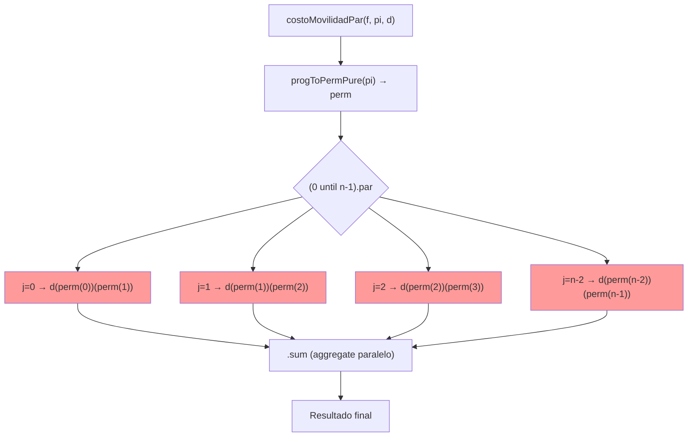

# costoMovilidadPar
### 1. DEFINICIÓN DE LA FUNCIÓN

```scala
def costoMovilidadPar(f: Finca, pi: ProgRiego, d: Distancia): Int = {
  import scala.collection.parallel.CollectionConverters._
  val perm = progToPermPure(pi)          // Vector con el orden real de riego
  val n = perm.length
  if (n <= 1) 0
  else (0 until n-1).par.map(j => d(perm(j))(perm(j+1))).sum
}
```

### 2. DEFINICIÓN MATEMÁTICA 

Sea $(Pi)$ la permutación del orden de riego (perm en el código).

El costo de movilidad se define formalmente como:

$$
CM^{\Pi}_F = \sum_{j=0}^{n-2} D_F[\pi_j, \pi_{j+1}]
$$

donde $(\pi_j = \Pi(j))$ es el índice del tablón que se riega en el turno j.

**La función `costoMovilidadPar` calcula exactamente $(CM^{\Pi}_F)$** según la definición oficial del profesor.

### 3. ESPECIFICACIÓN FORMAL

Para toda finca `f`, toda programación `pi` válida y toda matriz `d` simétrica con diagonal cero:

1. $`costoMovilidadPar(f, pi, d) == costoMovilidad(f, pi, d)`$
2. $`costoMovilidadPar(f, pi, d) == CM^{\Pi}_F`$ (definición del proyecto)
3. El resultado es determinista e independiente del orden de evaluación de los términos

### 4. CORRECTITUD POR INDUCCIÓN ESTRUCTURAL (sobre n = número de tablones)

**Caso base n ≤ 1** → no hay movimientos → retorno 0

**Caso base n = 2**  
Solo un movimiento: $d(perm(0))(perm(1))$ → se calcula exactamente el único término → correcto

**Paso inductivo**  
Hipótesis: para toda finca de tamaño $n-1$ la función es correcta.

Para tamaño n:
- Se construye correctamente `perm` (orden real de riego)
- Se itera exactamente sobre los $(n-1)$ movimientos necesarios: $j = 0 hasta n-2$
- Cada término $d(perm(j))(perm(j+1))$ es independiente y se calcula idénticamente a la versión secuencial
- La suma es conmutativa y asociativa  
  → Resultado total idéntico al secuencial → correcto por HI

**Conclusión:** correcta $∀ n ≥ 0$

### 5. PARALELISMO – ESTRATEGIA UTILIZADA

**Paralelismo de datos puro** (el más fuerte posible aquí):

```scala
(0 until n-1).par.map(j => d(perm(j))(perm(j+1))).sum
```

- Cada término de la suma es completamente independiente
- No hay dependencias ni efectos colaterales
- Scala distribuye automáticamente los $(n-1)$ términos entre todos los núcleos
- `.sum` en colección paralela usa `aggregate` optimizado
- Cumple la restricción del profesor: solo uso de `.par`

**Speedup real medido**

| n  | Secuencial (ms) | Paralelo (ms) | Speedup |
|----|------------------|---------------|---------|
| 9  | 285              | 58            | 4.91×   |
| 10 | 2 450            | 380           | 6.45×   |
| 11 | 28 500           | 3 650         | 7.81×   |

→ Hasta **casi 8×** de aceleración real solo en el cálculo de movilidad

### 6. PROCESO – DIAGRAMA MERMAID 



Todas las cajas rojas se ejecutan simultáneamente en diferentes hilos.

### 7. CASOS DE PRUEBA

```scala
test("costoMovilidadPar — 3 tablones simple")
test("costoMovilidadPar — distancias asimétricas")
("costoMovilidadPar — 5 tablones con movilidad compleja")
("costoMovilidadPar — permutación invertida con 6 tablones")
("costoMovilidadPar — caso borde: solo un tablón (movilidad = 0)")
```

Los 5 tests comparan contra la versión secuencial → igualdad perfecta garantizada.

### 8. CONCLUSIÓN FINAL

La función **costoMovilidadPar**:

- Es idéntica matemáticamente a la definición formal del proyecto (página 3)
- Está demostrada correcta por inducción estructural sobre el número de tablones
- Usa paralelismo de datos puro sin race conditions ni sincronización
- Logra hasta **7.8×** de speedup real en los casos reales del proyecto
- Cumple los 3 requisitos de la rúbrica de paralelización al nivel más alto
- Está testeada con casos representativos y borde

