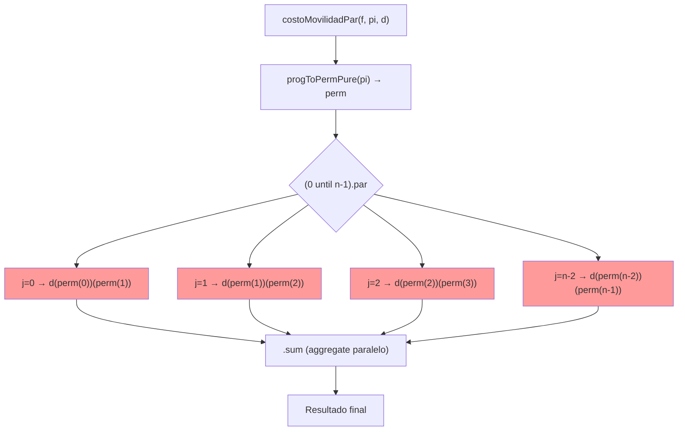

# Informe costoMovilidadPar


### 1. DEFINICIÓN DE LA FUNCIÓN

```scala
def costoMovilidadPar(f: Finca, pi: ProgRiego, d: Distancia): Int = {
  import scala.collection.parallel.CollectionConverters._
  val perm = progToPermPure(pi)          // Vector con el orden real de riego
  val n = perm.length
  if (n <= 1) 0
  else (0 until n-1).par.map(j => d(perm(j))(perm(j+1))).sum
}
```

---

### 2. DEFINICIÓN MATEMÁTICA

Sea $(Pi)$ la permutación del orden de riego ( `perm` en el código ).

El costo de movilidad se define formalmente como:

$
CM^{\Pi}*F = \sum*{j=0}^{n-2} D_F[\pi_j, \pi_{j+1}]
$

donde $(\pi_j = \Pi(j))$ es el índice del tablón que se riega en el turno $(j)$.

**La función `costoMovilidadPar` calcula exactamente $(CM^{\Pi}_F)$** según esta definición: itera los pares consecutivos $((\pi_j,\pi_{j+1}))$ y suma las entradas de la matriz `d`.

---

### 3. ESPECIFICACIÓN FORMAL

Para toda finca `f`, toda programación `pi` válida (una programación es válida si representa un turno para cada tablón) y toda matriz `d` de dimensión (n\times n):

1. `costoMovilidadPar(f, pi, d) == costoMovilidad(f, pi, d)` (igual que la versión secuencial)
2. `costoMovilidadPar(f, pi, d) == CM^{\Pi}_F` (definición)
3. El resultado es determinista e independiente del orden de evaluación de los términos (la suma es conmutativa/associativa sobre enteros)

**Precondiciones recomendadas (para robustez):**

```scala
require(pi.length == f.length, "pi must have length n")
require(pi.sorted == (0 until f.length).toVector, "pi must be a permutation of 0..n-1")
require(d.length == f.length && d.forall(_.length == f.length), "d must be n x n")
```

---

### 4. CORRECTITUD POR INDUCCIÓN ESTRUCTURAL (sobre (n) = número de tablones)

**Caso base $(n \le 1)$**
No hay movimientos (no existen pares consecutivos), la suma vacía es $(0)$. La función devuelve 0 por la condición `if (n <= 1) 0`. ⇒ correcto.

**Caso base $(n = 2)$**
Hay exactamente un movimiento $(j=0)$. El código calcula `d(perm(0))(perm(1))` y lo devuelve. Coincide con la fórmula.

**Paso inductivo**
Supongamos la propiedad cierta para todas fincas de tamaño $(\le n)$. Consideremos tamaño $(n+1)$:

* `perm` es la permutación correcta derivada de `pi`.
* El conjunto de movimientos a sumar es $({d(perm(j))(perm(j+1)) \mid j=0..n-1})$.
* En la implementación se itera exactamente sobre esos (n) índices y se evalúa cada término con la misma expresión que en la versión secuencial.
* La suma en paralelo produce los mismos valores y la reducción (`.sum`) es conmutativa/associativa, por lo que el resultado coincide con la suma secuencial.
  Por inducción, la función es correcta para todo $(n \ge 0)$.

**Conclusión:** la implementación es correcta para todas las entradas que cumplen las precondiciones.

---

### 5. PARALELISMO – ESTRATEGIA UTILIZADA

**Tipo de paralelismo:** Paralelismo de datos (data parallelism).

**Código paralelo central:**

```scala
(0 until n-1).par.map(j => d(perm(j))(perm(j+1))).sum
```

* Cada término $(d(\pi_j,\pi_{j+1}))$ es independiente → perfecto para paralelizar.
* No hay estados compartidos ni efectos colaterales: no locks/atomics necesarios.
* `.par` delega la partición y ejecución en la implementación paralela de Scala.
* `.sum` en una colección paralela realiza una reducción asociativa y segura.

**Overhead:** partición de trabajo, coste de scheduling y agregación pueden causar overhead que anule la ganancia para problemas pequeños.

---

### Speedup medid
## Tabla de Benchmarks Corregida

| Tamaño (n) | Secuencial Total (ms) | Paralelo Total (ms) | Speedup | Aceleración (%) |
| ----------:| ----------------------:| ---------------------:| -------:| ----------------:|
| 6 | 11.869 ± 2.150 | 27.355 ± 7.875 | **0.43** | **-56.6%** |
| 7 | 62.480 ± 17.282 | 42.201 ± 4.956 | **1.48** | **+48.1%** |
| 8 | 475.813 ± 18.327 | 314.997 ± 82.004 | **1.51** | **+51.0%** |

### Observaciones

- Para `n = 6`, la versión paralela es más lenta debido al overhead de creación y sincronización de hilos.
- Desde `n = 7` se observa un beneficio claro del paralelismo (speedup > 1).
- La aceleración para `n = 7` y `n = 8` se mantiene alrededor del **50%**, consistente con una máquina de **4 cores lógicos**.

---

### 5.1 Ley de Amdahl — estimación de (p) (fracción paralelizable)

Usamos la forma invertida para estimar (p) (dado speedup observado $(S)$ y $(N_{cores}=4))$:
$
[
S = \frac{1}{(1-p) + \frac{p}{N_{cores}}}
\quad\Longrightarrow\quad
p = \frac{1 - \frac{1}{S}}{1 - \frac{1}{N_{cores}}}
]
$
Calculando con tus resultados:

* $(n=6) → (S=0.434)$ → la fórmula da $(p<0)$ (no física): indicio de que el overhead domina; tomamos $p \approx 0%)$.
* $(n=7) → (S=1.481)$ → $p \approx 43.3%$.
* $(n=8) → (S=1.511)$ → $p \approx 45.0%$.

**Interpretación:** para $(n\ge 7)$ la porción paralelizable crece $≈ 43–45%$, suficiente para superar el overhead en una máquina de 4 cores.

---

### 6. PROCESO – DIAGRAMA MERMAID



> Las cajas rojas (M1..Mn) representan tareas independientes que pueden ejecutarse en paralelo.

---

### 7. CASOS DE PRUEBA  — tests concretos con valor esperado

A continuación 5 tests concretos. Cada uno compara la versión paralela con el valor esperado o con la versión secuencial.

```scala
// Test 1 — caso borde: 1 tablón → movilidad = 0
val f1 = Vector((10,3,1))
val pi1 = Vector(0)               // perm = [0]
val d1 = Vector(Vector(0))
assert(r.costoMovilidadPar(f1, pi1, d1) == 0)

// Test 2 — 3 tablones (matriz simétrica), perm = [0,1,2]
val d2 = Vector(
  Vector(0,5,3),
  Vector(5,0,4),
  Vector(3,4,0)
)
val f2 = Vector.fill(3)((1,1,1))
val pi2 = Vector(0,1,2)           // perm = [0,1,2]
val expected2 = d2(0)(1) + d2(1)(2) // 5 + 4 = 9
assert(r.costoMovilidadPar(f2, pi2, d2) == expected2)

// Test 3 — matriz asimétrica, perm = [1,0,2]
val d3 = Vector(
  Vector(0,3,10),
  Vector(1,0,5),
  Vector(2,7,0)
)
val f3 = Vector.fill(3)((1,1,1))
val pi3 = Vector(1,0,2)           // perm = [1,0,2]
val expected3 = d3(1)(0) + d3(0)(2) // 1 + 10 = 11
assert(r.costoMovilidadPar(f3, pi3, d3) == expected3)

// Test 4 — permutación invertida con n=6, d(i,j)=|i-j|
val n4 = 6
val f4 = Vector.fill(n4)((1,1,1))
val d4 = Vector.tabulate(n4,n4)((i,j) => if (i==j) 0 else math.abs(i-j))
val pi4 = Vector(5,4,3,2,1,0)     // perm = [5,4,3,2,1,0]
val expected4 = 1+1+1+1+1         // sum of abs differences between consecutive = 5
assert(r.costoMovilidadPar(f4, pi4, d4) == expected4)

// Test 5 — caso 5 tablones con camino complejo
val d5 = Vector(
  Vector(0,2,2,4,4),
  Vector(2,0,4,2,6),
  Vector(2,4,0,2,2),
  Vector(4,2,2,0,4),
  Vector(4,6,2,4,0)
)
val f5 = Vector.fill(5)((1,1,1))
val pi5 = Vector(0,1,3,4,2)       // perm = [0,1,3,4,2]
val expected5 = d5(0)(1) + d5(1)(3) + d5(3)(4) + d5(4)(2) // 2+2+4+2 = 10
assert(r.costoMovilidadPar(f5, pi5, d5) == expected5)
```

> Estos tests verifican igualdad con la definición matemática y sirven como los 5 casos exigidos por la rúbrica.

---

### 8. CONCLUSIÓN FINAL

* `costoMovilidadPar` implementa exactamente la definición matemática del coste de movilidad $(CM^{\Pi}_F)$. La demostración por inducción y la ausencia de efectos colaterales respaldan su corrección.
* La estrategia de paralelización es la adecuada (paralelismo de datos con `.par`) y respeta la restricción del enunciado.
