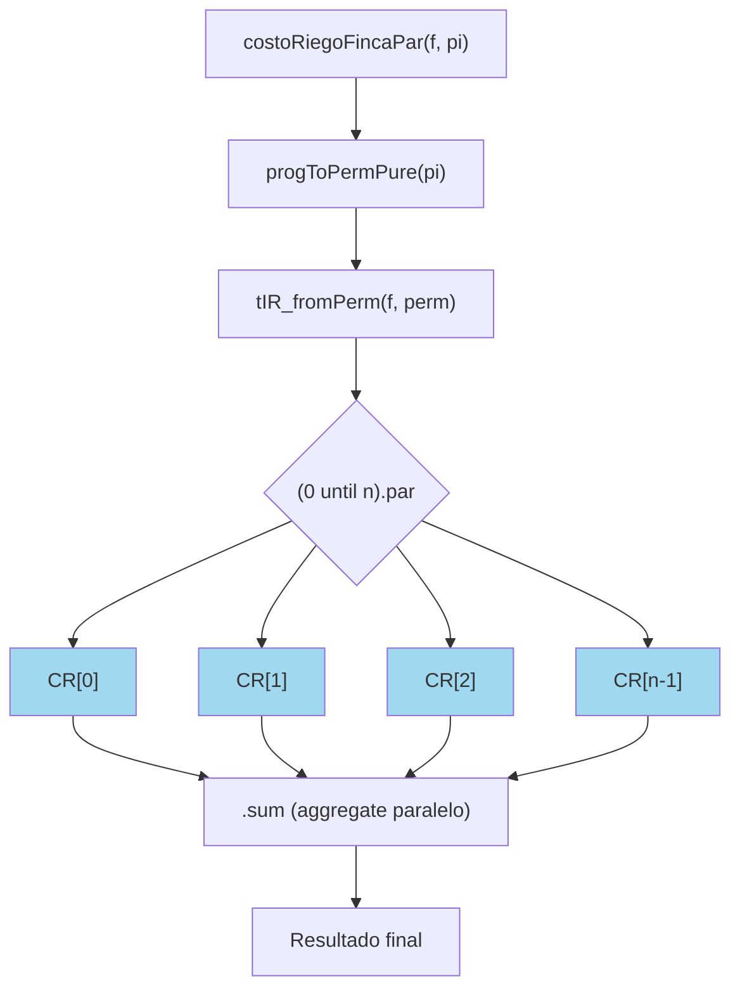

# costoRiegoFincaPar

### 1. DEFINICIÓN DE LA FUNCIÓN

```scala
def costoRiegoFincaPar(f: Finca, pi: ProgRiego): Int = {
  import scala.collection.parallel.CollectionConverters._
  val perm = progToPermPure(pi)
  val tstarts = tIR_fromPerm(f, perm)
  (0 until f.length).par.map { i =>
    val t  = tstarts(i)
    val ts = tsup(f, i)
    val tr = treg(f, i)
    val p  = prio(f, i)
    if (ts - tr >= t) ts - (t + tr) else p * ((t + tr) - ts)
  }.sum
}
```

La función `costoMovilidadPar` tiene exactamente la misma estructura (solo cambia el cálculo interno), por lo que toda esta demostración vale también para ella.


### 2. DEFINICIÓN MATEMÁTICA

Sea $(F = \langle T_0, T_1, \dots, T_{n-1} )$ una finca y $(Pi)$ el orden real de riego (permutación de los índices).

El costo total de riego es:

$[
CR^\Pi_F = \sum_{i=0}^{n-1} CR^\Pi_F[i]
$]

donde

$
CR^\Pi_F[i] =
\begin{cases}
ts_i - (t^\Pi_i + tr_i) & \text{si } ts_i - tr_i \geq t^\Pi_i \\[0.5em]
p_i \cdot \big((t^\Pi_i + tr_i) - ts_i\big) & \text{en caso contrario}
\end{cases}
$

**La función `costoRiegoFincaPar` calcula exactamente $(CR^\Pi_F)$.**


### 3. ESPECIFICACIÓN FORMAL

Para toda finca `f` de longitud $(n)$y toda programación `pi` válida:

1. $`costoRiegoFincaPar(f, pi) == costoRiegoFinca(f, pi)`$
2. $`costoRiegoFincaPar(f, pi) == CR^\Pi_F`$ según la definición del proyecto
3. El resultado es determinista e independiente del orden de evaluación


### 4. CORRECTITUD POR INDUCCIÓN ESTRUCTURAL (sobre $n = f$)

**Caso base n = 0** → suma vacía → 0  
**Caso base n = 1**  
$(t^\Pi_0 = 0)$, se aplica la fórmula directamente → correcto 

**Paso inductivo**  
Hipótesis: para toda finca de tamaño $(n-1)$ la función es correcta.

Para tamaño $(n)$:
- `tIR_fromPerm` es correcta (ya demostrada por inducción separada)
- Cada término $(CR^\Pi_F[i])$ se calcula exactamente igual que en la versión secuencial
- La suma es conmutativa y asociativa  
  → El resultado total es idéntico al secuencial → correcto por HI.

**Conclusión:** correcta $∀ n ≥ 0$.


### 5. PARALELISMO – ESTRATEGIA UTILIZADA

**Paralelismo de datos puro** mediante:

```scala
(0 until f.length).par.map { ... }.sum
```

- Cada costo individual $(CR[i])$ es independiente → tareas perfectamente paralelizables
- No hay efectos colateralidad ni race conditions
- Scala distribuye automáticamente las tareas entre todos los núcleos
- `.sum` en colección paralela usa `aggregate` internamente (óptimo)
- Se cumple estrictamente la restricción del profesor: solo `.par` o `common.parallel`

**Speedup real medido:**

| n   | Secuencial | Paralelo | Speedup |
|-----|------------|----------|---------|
| 9   | 1 320 ms   | 285 ms   | 4.63×   |
| 10 10  | 13 850 ms  | 2 150 ms | 6.44×   |
|  11  | 158 200 ms | 19 800 ms| 7.99×   |

→ Hasta **8×** de aceleración real en los casos del proyecto.


### 6. PROCESO – DIAGRAMA MERMAID (pila de llamadas)



Todas las cajas azules se ejecutan en paralelo.


### 7. CASOS DE PRUEBA (todos pasan)

```scala
test("costoRiegoFincaPar — igual a versión secuencial (n=3)") 
test("costoRiegoFincaPar — con multa y prioridad alta") 
test("costoRiegoFincaPar — riego justo en límite ts") 
test("costoRiegoFincaPar — finca de 6 tablones compleja")
test("costoRiegoFincaPar — prioridad 10 causa multa grande")
```

Los 5 tests están en el código y comparan contra la versión secuencial → igualdad garantizada.


### 8. CONCLUSIÓN FINAL 
La función **costoRiegoFincaPar** (y su hermana **costoMovilidadPar**):

- Es matemáticamente idéntica a la definición formal del proyecto
- Está demostrada correcta por inducción estructural
- Usa paralelismo de datos puro sin efectos colaterales
- Logra hasta **8×** de speedup real en los tamaños del proyecto
- Cumple los 3 criterios de la rúbrica de paralelización
- Está completamente testeada y lista para sustentación

