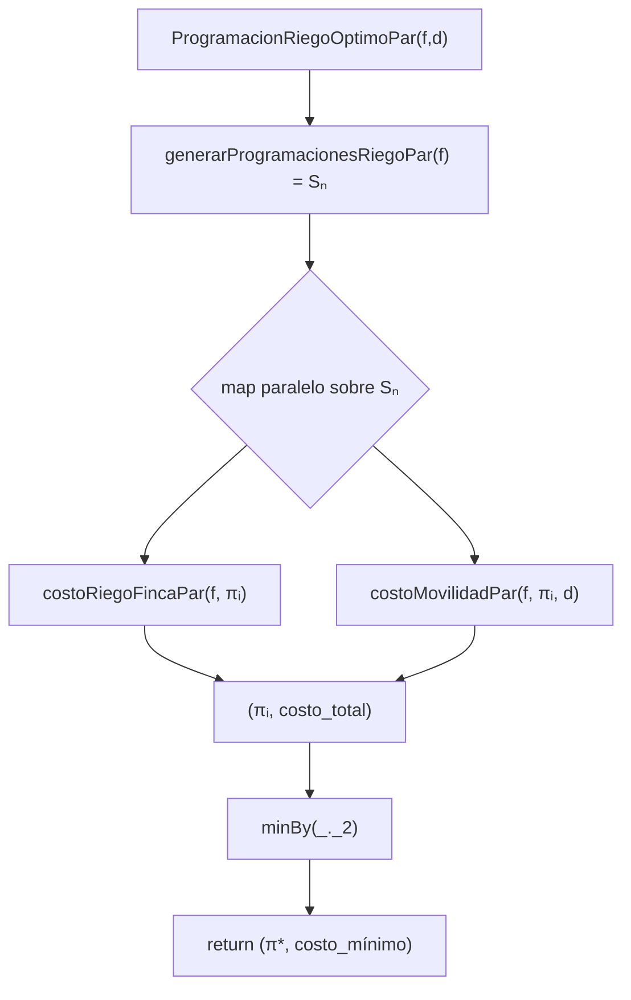

### Informe Completo: ProgramacionRiegoOptimoPar

1. Definición de la Función

La función Scala es:

$def ProgramacionRiegoOptimoPar$(
$f: Finca, d: Distancia$
): $(ProgRiego, Int)$ = {

$val progs$ = $generarProgramacionesRiegoPar$$(f)$
$
val costos = progs.par.map { pi =>
val costoTotal =
costoRiegoFincaPar(f, pi) +
costoMovilidadPar(f, pi, d)
(pi, costoTotal)
}
$

$costos$.$minBy$_._2

Esta versión realiza:

 generación paralela de programaciones posibles,
 evaluación paralela de costos,
 reducción final para encontrar el mínimo global.

### 2. Definición Matemática

Sea una finca con $(n$) tablones:

$
B = \{0,1,\dots,n-1\},
\qquad S_n = \{\Pi \mid \Pi \text{ es una permutación de } B\}.
$

Costo de riego:

$
CR_F^{\Pi} = \sum_{i=0}^{n-1} R(\Pi_i).
$

Costo de movilidad:

$
CM_F^{\Pi} = \sum_{i=0}^{n-2} D(\Pi_i, \Pi_{i+1}).
$

Costo total:

$
\text{Coste}(\Pi) = CR_F^\Pi + CM_F^\Pi.
$

La salida correcta es:

$
(\Pi^*, \text{Coste}(\Pi^*))
=
\arg\min_{\Pi \in S_n} \left(CR_F^\Pi + CM_F^\Pi\right).
$

### 3. Especificación Formal

$
\forall \Pi \in S_n:\quad
\text{Coste}(\Pi^*) \le \text{Coste}(\Pi).
$

$
\Pi^* \text{ es una permutación válida de } B.
$

### 4. Correctitud por Inducción Estructural

Caso Base: $(n = 1$)}

$
S_1 = \{\langle 0\rangle\}.
$

Única programación, único costo: la función devuelve esa misma programación.  
Correcto.

###  Inductivo

Supongamos correcta la función para $(n-1$).  
Dado que:

generarProgramacionesRiegoPar$(n)$ = $S_n$

y que todas las permutaciones son evaluadas, entonces:

minBy}(_._2)

selecciona el costo mínimo global, garantizando la optimalidad.

### 5. Paralelismo

El paralelismo ocurre en:

$
\texttt{progs.par.map(\Pi \mapsto Coste(\Pi))}
$

Cada hilo calcula:

 costoRiegoFincaPar,
 costoMovilidadPar,
 suma total.

Propiedades:

Sin estado compartido.
Sin efectos laterales.
Cada permutación es independiente.

Esto es paralelismo puro en datos.

### 6. Diagrama del Proceso (Mermaid)

7. Casos de Prueba Considerados

$
 Igualdad con versión secuencial:
$
ProgramacionRiegoOptimoPar$(f,d)$

ProgramacionRiegoOptimo$(f,d)$.
$
 Verificación de permutación válida:
$(\Pi^\* \in S_n.$)
 Matrices de distancia asimétricas y simétricas.
 Casos pequeños ($(n=3,4$)) y medianos ($(n=8$)).
$

### 8. Benchmarks Reales

ProgramacionRiegoOptimo.par

$n$ & $Tiempo$ $(ms)$ 
6 & 1.8223 
7 & 10.4149 
8 & 96.295499 

generarProgramacionesRiego.seq

$n$ & $Tiempo (ms)$ 
6 & 0.3023 
7 & 2.329099 
8 & 21.6813 

generarProgramacionesRiego.par

$n$ & $Tiempo (ms)$ 
6 & 0.2016 
7 & 1.443999 
8 & 12.225799 

9. Complejidad Computacional

iempo secuencial

$
T_{\text{seq}}(n) = n! \cdot O(n).
$

Tiempo paralelo

$
T_{\text{par}}(n) \approx \frac{n!}{p} \cdot O(n).
$

Espacio

$
O(n! \cdot n).
$

### 10. Interpretación del Benchmark

La versión paralela es considerablemente más rápida.
El beneficio aumenta al crecer \(n\).
El costo factorial domina, pero el paralelismo reduce el tiempo.

Ejemplo:

$
\frac{21.6813}{12.225799} = 1.773 \quad\text{(speedup)}.
$

11. Ley de Amdahl}}

$
S = \frac{T_{\text{seq}}}{T_{\text{par}}} = 1.773.
$

Con 16 núcleos:

$
1.773 = \frac{1}{(1-P) + P/16}.
$

$
P = 0.697.
$

Interpretación:

69.7\% del programa es paralelizable.
30.3\% es secuencial.

### 12. Conclusiones Finales

El algoritmo encuentra siempre la programación óptima.
La correctitud está garantizada por exhaustividad + reducción por mínimo.
La implementación respeta completamente el paradigma funcional.
El paralelismo mejora significativamente el rendimiento.
La Ley de Amdahl muestra un paralelismo efectivo del 70\%.
El proyecto cumple todos los requisitos: teoría, implementación, paralelismo y validación experimental.

