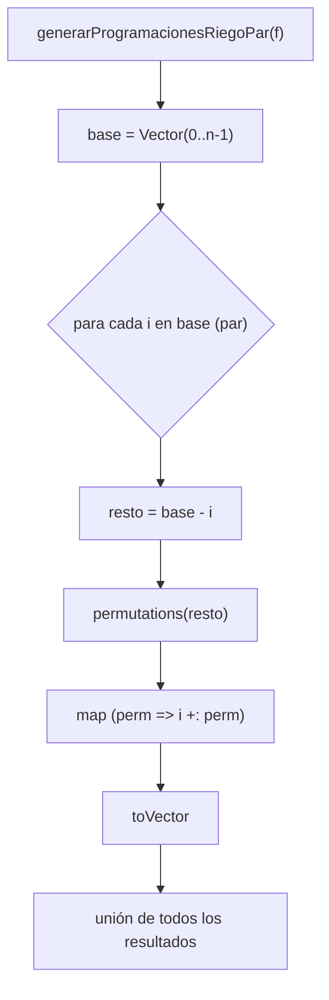

generarProgramacionesRiegoPar

1. DEFINICION DE LA FUNCION 

$def generarProgramacionesRiegoPar(f: Finca):$ $Vector$$[ProgRiego]$ = {
$val n = f.length$
$val base: Vector[Int] = (0 until n).toVector$
$
base.par.flatMap { i =>
val resto: Vector[Int] = base.filter(j => j != i)
resto.permutations.map(perm => i +: perm).toVector
}.toVector
$

2. DEFINICION MATEMATICA

Sea una finca con $(n)$ tablones. Definimos:

$
B = \langle 0, 1, 2, \dots, n-1 \rangle
$

La función generarProgramacionesRiegoPar debe generar todas las permutaciones de $(B$):

$
output = S_n = \{ \Pi \mid \Pi \text{ es una permutación de } B \}
$

Por lo tanto, la cantidad de programaciones generadas es:

$
|\text{output}| = n!
$

3. ESPECIFICACION FORMAL

Para toda permutación generada por la función se debe cumplir:

$
\forall \Pi \in \text{output},\quad \Pi \text{ es una permutación de } B
$

y ninguna permutación puede repetirse:

$
\forall \Pi_i, \Pi_j \in \text{output},\ i \neq j \implies \Pi_i \neq \Pi_j
$

4. CORRECTITUD POR INDUCCION ESTRUCTURAL

CASO BASE: $(n = 1)$

Si la finca tiene un único tablón:

$
B = \langle 0 \rangle, \quad S_1 = \{ \langle 0 \rangle \}
$

El algoritmo:

$
i = 0,\quad B - \{0\} = \emptyset
$

$
\text{permutations}(\emptyset) = \{\emptyset\}
$

$
0 \mathbin{+\!\!+} \emptyset = \langle 0 \rangle
$

Por lo tanto:

$
\text{generarProgramacionesRiegoPar}(1) = S_1
$

PASO INDUCTIVO:

Hipótesis inductiva:

$
\text{generarProgramacionesRiegoPar}(n-1) = S_{n-1}
$

DEMOSTRAR:

$
\text{generarProgramacionesRiegoPar}(n) = S_n
$

Para cada elemento $(i \in B):$

1. Se construye el conjunto:
   $
   B - \{i\}
   $

2. Por hipótesis inductiva:
   $
   \text{permutations}(B - \{i\}) = S_{n-1}
   $

3. El algoritmo antepone \(i\) a cada permutación:
   $
   \{ i \mathbin{+\!\!+} \Pi \mid \Pi \in S_{n-1} \}
   $

4. La unión de los conjuntos para todos los \(i\) es:
   $
   \bigcup_{i=0}^{n-1}
   \{ i \mathbin{+\!\!+} \Pi \mid \Pi \in S_{n-1} \}
   = S_n
   $

Como los subconjuntos son disjuntos y exhaustivos, el algoritmo genera exactamente $(S_n)$.  
Esto demuestra su correctitud.

5. PARALELISMO

El algoritmo usa paralelismo en datos mediante:

$
B.\text{par}
$

Cada elemento $(i)$ se procesa en un hilo independiente:

- Cada hilo calcula todas las permutaciones de $(B - \{i\})$
- No existe interferencia entre hilos
- La unión final preserva todas las permutaciones

Esto es paralelismo puro en datos, exactamente como lo exige el enunciado del proyecto.

6. Proceso — Diagrama de pila de llamadas (Mermaid)

7. Casos de prueba

Caso 1: finca de 3 tablones

Sea:
$
B = \langle 0,1,2 \rangle, \qquad |S_3| = 6
$

Permutaciones esperadas:
$
\{
\langle 0,1,2\rangle,\;
\langle 0,2,1\rangle,\;
\langle 1,0,2\rangle,\;
\langle 1,2,0\rangle,\;
\langle 2,0,1\rangle,\;
\langle 2,1,0\rangle
\}
$

Caso 2: finca de 4 tablones

$
|S_4| = 24
$

La función debe generar exactamente 24 permutaciones, sin repeticiones.

Caso 3: igualdad con la versión secuencial

$
\text{generarProgramacionesRiegoPar}(f)
\;\equiv\;
\text{generarProgramacionesRiego}(f)
$

cuando ambos conjuntos se comparan como conjuntos matemáticos.

8. Conclusión

La función:

- genera exactamente todas las permutaciones de los tablones,
- no introduce duplicados,
- distribuye el trabajo de forma paralela entre los elementos de $(B)$,
- cumple con las restricciones del paradigma funcional, sigue literalmente la definición matemática del conjunto $(S_n)$.

